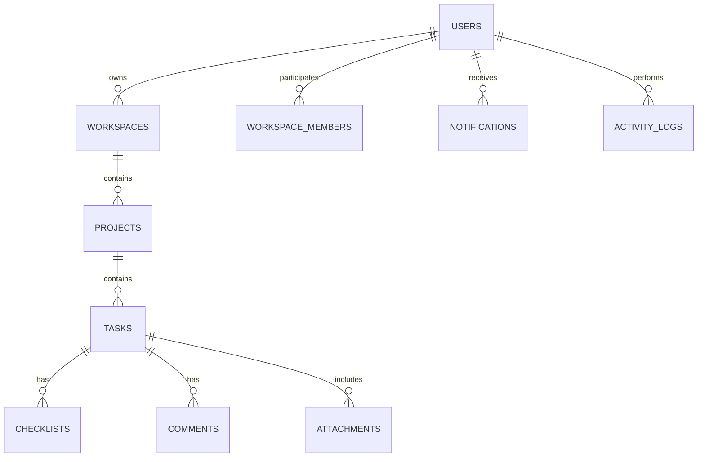

# TaskFlow Relational ERD Architecture

TaskFlow utilizes a normalized PostgreSQL database managed through versioned Flyway migrations.

## High-Level Relational Schema Diagram

## Schema Entities
- `users`: Core account identity
- `workspaces`: Multi-tenant boundary
- `projects`: Workspace containers
- `tasks`: Work item entities
- `tags`: Tagging taxonomy
- `checklists`: Subtask items
- `comments`: Task conversation threads
- `attachments`: File reference meta
- `reminders`: Time-triggered notifications
- `calendar_events`: Time blocking items
- `notifications`: User notification center
- `activity_logs`: Audit trail
- `roles` / `permissions`: Security access control
