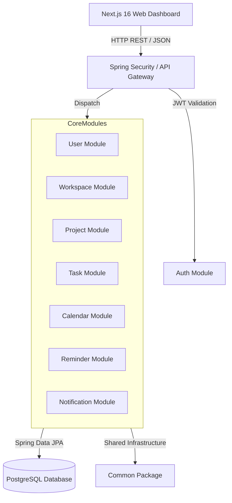
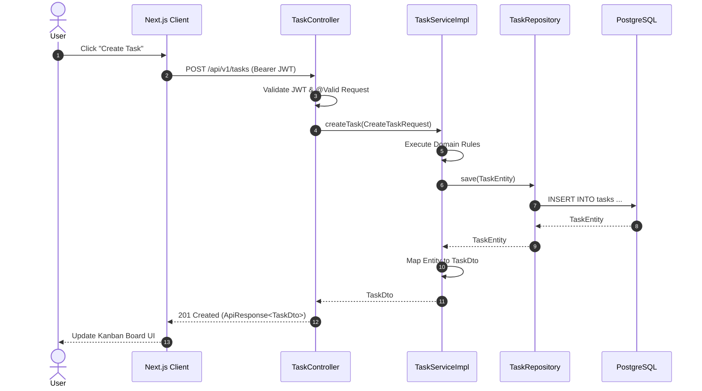

# TaskFlow Architectural Design Document (`architecture.md`)

This document presents the high-level system architecture, modular design patterns, dependency boundaries, data flows, and scalability strategies for **TaskFlow**.

---

## # Architectural Vision & Core Choices

### 1. Why Domain-Driven Design (DDD)?
Domain-Driven Design ensures that TaskFlow's technical implementation reflects its core business domain. Each functional capability (Auth, Workspace, Project, Task, Calendar, Reminder, Notification) is modeled as a distinct **Bounded Context**. This prevents domain logic leakage, reduces cognitive load, and enables independent domain evolution.

### 2. Why Feature-First Organization?
Traditional Layer-First architectures (grouping code into global `controllers/`, `services/`, `repositories/` folders) create high coupling and scatter related domain code across the codebase. Feature-First organization co-locates all assets (Entities, Repositories, Services, Controllers, Components, Hooks) inside a single feature directory, maximizing cohesion and ease of navigation.

### 3. Why Monorepo?
TaskFlow uses a unified Monorepo structure (`code/frontend`, `code/backend`, `docs/`) to maintain a single source of truth. Monorepo development enables atomic commits across client and server, shared type definitions, and streamlined CI/CD execution without managing multi-repo deployment synchronization.

---

## # System High-Level Architecture



---

## # Package & Directory Boundaries

### 1. Common Package (`com.taskflow.common`)
Cross-cutting framework infrastructure shared across all modules:
- `BaseEntity`: Standardized JPA entity auditing (`id`, `createdAt`, `updatedAt`, `createdBy`, `updatedBy`).
- `ApiResponse<T>`: Universal REST API response envelope.
- `GlobalExceptionHandler`: Application-wide `@RestControllerAdvice` error transformer.
- `SecurityUtils`: Thread-local JWT authentication context extraction utilities.

### 2. Shared Package (`com.taskflow.shared`)
Cross-domain utilities, pure helper functions, string transformers, date/time calculation utilities, and shared system constants.

### 3. Module Encapsulation (`com.taskflow.modules.*`)
Every domain module operates as an autonomous package with standardized internal structure:

```
com.taskflow.modules.<module-name>/
├── controller/        # REST Controllers (@RestController)
├── service/           # Business Service Interfaces
│   └── impl/          # Concrete Service Implementations
├── repository/        # Spring Data JPA Repositories
├── entity/            # JPA Entities (@Entity)
├── dto/               # Request & Response DTOs
├── mapper/            # Entity <-> DTO Mappers
├── validator/         # Business Validation Logic
└── specification/     # Dynamic Search Criteria
```

---

## # Module Communication & Dependency Rules

### 1. Inter-Module Dependency Rules
- **Rule 1 (Service Isolation)**: A module MUST NOT inject or call a `Repository` belonging to another module.
- **Rule 2 (Service-to-Service Communication)**: Inter-module communication MUST occur exclusively through the target module's public `Service` interface.
- **Rule 3 (No Direct Entity Passing)**: Data passed between modules MUST be encapsulated in DTOs or primitive values, never raw JPA Entities.

```
✅ Allowed: WorkspaceServiceImpl -> TaskService (Interface)
❌ Forbidden: WorkspaceServiceImpl -> TaskRepository
❌ Forbidden: TaskController -> WorkspaceRepository
```

### 2. Event-Driven Asynchronous Communication
For non-blocking cross-module side effects (e.g., triggering a Notification when a Task is assigned), modules publish application events via Spring's `ApplicationEventPublisher`:

```java
// Publishing an event in TaskServiceImpl
eventPublisher.publishEvent(new TaskAssignedEvent(taskId, assigneeId, assignedBy));

// Listening in NotificationServiceImpl
@EventListener
public void handleTaskAssigned(TaskAssignedEvent event) {
    notificationService.sendNotification(...);
}
```

---

## # Data & Authentication Flow

### 1. Authentication & API Flow



---

## # How to Add a New Domain Module

To add a new domain module (e.g., `note` module for Phase 3):

1. **Create Backend Package**:
   - Create `com.taskflow.modules.note` with sub-packages `controller`, `service`, `impl`, `repository`, `entity`, `dto`, `mapper`.
2. **Define Database Migration**:
   - Add `src/main/resources/db/migration/V<N>__create_notes_table.sql`.
3. **Implement Domain Entities & DTOs**:
   - Create `NoteEntity extends BaseEntity` and corresponding DTOs (`NoteDto`, `CreateNoteRequest`).
4. **Build Service & Controller**:
   - Create `NoteService` interface, `NoteServiceImpl`, and `NoteController` annotated with `@RestController` and `@Tag(name = "Note Management")`.
5. **Create Frontend Feature Module**:
   - Create `code/frontend/src/features/note` with sub-directories `components`, `hooks`, `services`, `types`.
6. **Register Query Hooks & Pages**:
   - Create TanStack Query custom hooks (`useNotes`, `useCreateNote`) and Next.js App Router page route (`app/(dashboard)/notes/page.tsx`).

---

## # Scalability & Future Microservice Migration

TaskFlow's DDD Feature-First structure guarantees seamless future migration to standalone microservices:
1. **Low Coupling**: Because modules interact exclusively via public service interfaces or events, each module can be extracted into an independent Spring Boot microservice runtime.
2. **Database Sharding Readiness**: Tables are isolated by bounded contexts using foreign key indexes rather than cross-database triggers, allowing database schema separation when needed.
3. **Stateless API Gateway**: Stateless JWT authentication allows instant scaling of backend container instances behind an AWS ALB or NGINX load balancer.
